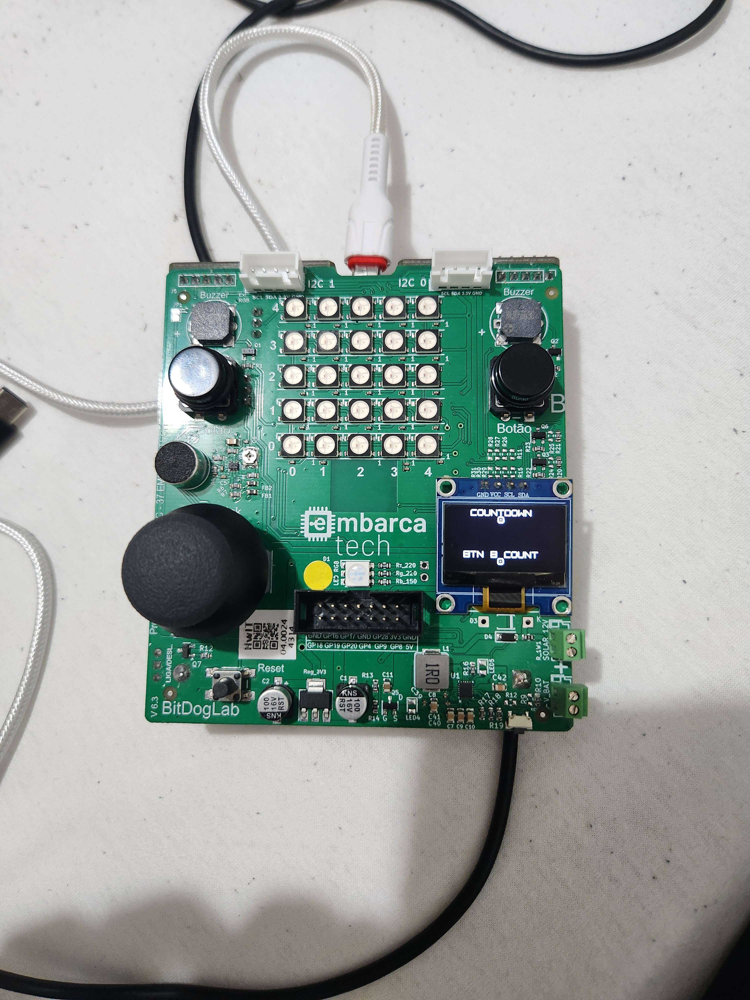

# Contador decrescente com registro de eventos por interrupção

Este projeto utiliza o OLED da BitDogLab para mostrar um contador que é ativado quando é pressionado o botão A. Quando o contador é ativado, é iniciado uma contagem regressiva à partir de 9 até 0 e, enquanto isso, será registrado quantos cliques no botão B são realizados nesse tempo.

## Objetivo

Teste de interrupção em pinos GPIOs, junto com a utilização do display OLED para concluir atividades do Embarca Tech e aprendizado dessas features.

## Lista de materiais:

| Componente         | Conexão na BitDogLab      |
| ------------------ | ------------------------- |
| BitDogLab (RP2040) | -                         |
| Botão A            | GPIO5                     |
| Botão B            | GPIO6                     |
| Display OLED I2C   | SDA: GPIO14 / SCL: GPIO15 |

## Execução

1. Abra o projeto no VS Code, usando o ambiente com suporte ao SDK do Raspberry Pi Pico (CMake + compilador ARM);
2. Compile o projeto normalmente (Ctrl+Shift+B no VS Code ou via terminal com cmake e make);
3. Conecte sua BitDogLab via cabo USB e coloque a Pico no modo de boot (pressione o botão BOOTSEL e conecte o cabo);
4. Copie o arquivo .uf2 gerado para a unidade de armazenamento que aparece (RPI-RP2);
5. A Pico reiniciará automaticamente e começará a executar o código;
6. O display OLED irá mostrar os valores de COUNTDOWN e de contagem de cliques do botão B

## Lógica

- O usuário pressiona o botão A
- O display OLED mostra a contagem regressiva de 9 a 0
- Enquanto ainda não terminou a contagem regressiva, é registrado a contagem de cliques do botão B
- Quando é finalizada a contagem regressiva, a contagem dos cliques do botão B é parada
- Repete o ciclo

## Arquivos

- `main.c`: Código principal do projeto;
- `assets/init_state.jpg`: Display OLED em execução;

## 🖼️ Imagens do Projeto

### Matriz de LEDs durante execução

---

## 📜 Licença

MIT License - MIT GPL-3.0.
