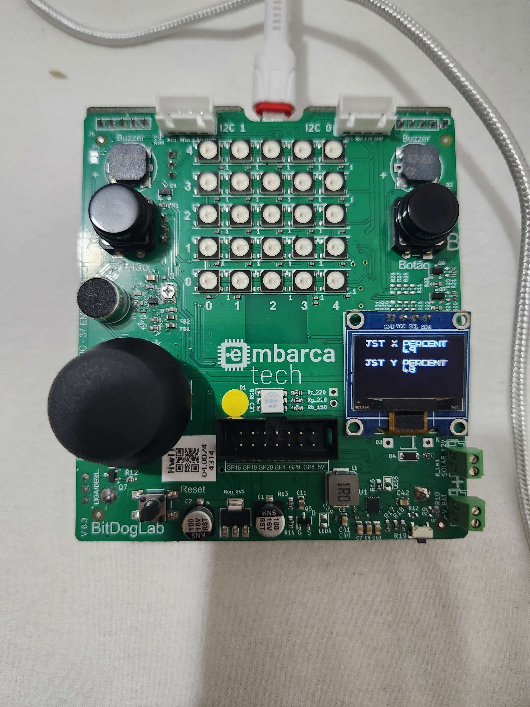

# Leitura dos sinais analógicos do joystick

Este projeto foi desenvolvido para a Raspberry Pi Pico W instalada na BitDogLab e tem como objetivo ler os valores dos eixos X e Y de um joystick, exibindo-os em tempo real em um display OLED. O código-fonte se encontra em `main.c` e faz uso dos recursos de entrada analógica e display I2C para apresentar os dados do joystick.

## Objetivo

- Ler os valores dos eixos X e Y do joystick conectado à BitDogLab.
- Exibir os valores em tempo real no display OLED.
- Demonstrar a integração entre a Raspberry Pi Pico W, o joystick e o display OLED utilizando interrupções e comunicação I2C.

## Lista de Materiais e Conexões

| Componente                | Conexão na BitDogLab (RP2040 Pico W) |
| ------------------------- | ------------------------------------ |
| BitDogLab (RP2040 Pico W) | -                                    |
| Joystick eixo X           | GPIO27                               |
| Joystick eixo Y           | GPIO26                               |
| Display OLED I2C          | SDA: GPIO14 / SCL: GPIO15            |

### Execução

1. Abra o projeto no VS Code, usando o ambiente com suporte ao SDK do Raspberry Pi Pico (CMake + compilador ARM);
2. Compile o projeto normalmente (Ctrl+Shift+B no VS Code ou via terminal com cmake e make);
3. Conecte sua BitDogLab via cabo USB e coloque a Pico no modo de boot (pressione o botão BOOTSEL e conecte o cabo);
4. Copie o arquivo .uf2 gerado para a unidade de armazenamento que aparece (RPI-RP2);
5. A Pico reiniciará automaticamente e começará a executar o código;
6. O display OLED irá mostrar os valores dos eixos X e Y do joystick

## Lógica do Projeto

- **Inicialização:**  
  O código inicia a configuração dos módulos de I2C para comunicação com o display OLED e a leitura dos canais analógicos do joystick.

- **Leitura e Processamento:**  
  É feita a leitura dos valores dos eixos X e Y utilizando os conversores analógicos para digitais (ADC).  
  Estes valores são processados e convertidos para uma escala compatível com o display.

- **Exibição:**  
  Os valores dos eixos são atualizados continuamente no display OLED, permitindo a visualização em tempo real da posição do joystick.

## Arquivos

- `main.c` – Código-fonte principal contendo toda a lógica de leitura dos valores do joystick e exibição no display OLED.
- `assets/init_state.jpg` - Foto demonstrando o funcionamento do programa

---

## 🖼️ Imagens do Projeto

### Caso base no OLED

---

## 📜 Licença

MIT License - MIT GPL-3.0.
