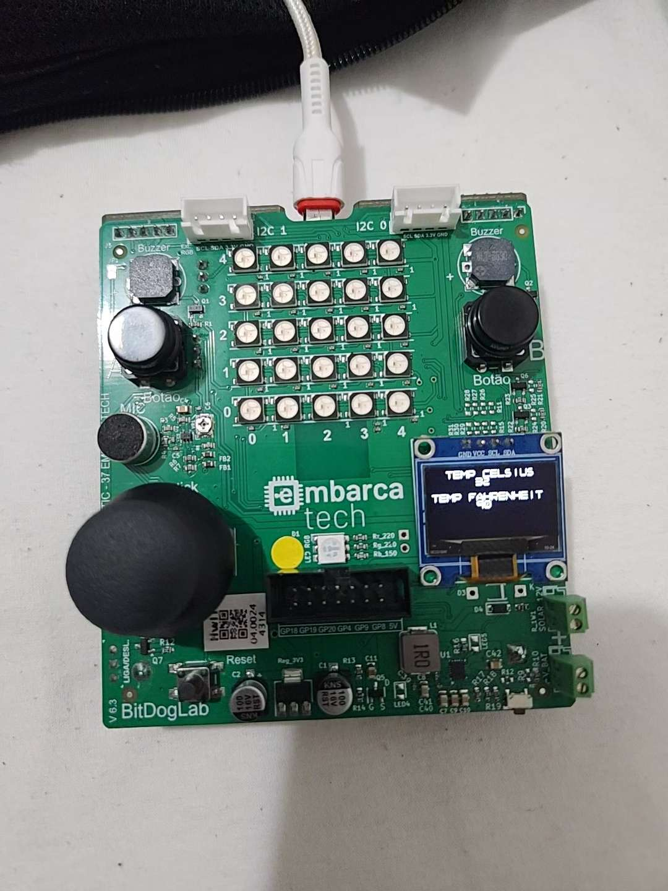

# Monitor de Temperatura Interna da MCU

Este projeto implementa um monitor de temperatura usando a **Raspberry Pi Pico W** na **BitDogLab**, lendo o valor do sensor de temperatura interno via ADC e exibindo em tempo real no display OLED SSD1306 por I²C.

---

## 🎯 Objetivos

- **Leitura Analógica**  
  Capturar o valor do sensor de temperatura interno da MCU usando o conversor ADC da Pico W.
- **Conversão de Unidades**  
  Converter a leitura ADC em graus Celsius e Fahrenheit.
- **Exibição Gráfica**  
  Mostrar, em tempo real, os valores de temperatura no display OLED 128×64 via I²C.
- **Testes Unitários**  
  Validar a função de conversão ADC → Celsius usando Unity.

---

## 📋 Materiais e Conexões

| Componente                    | Conexão na BitDogLab (RP2040 Pico W) |
| :---------------------------- | :----------------------------------: |
| Raspberry Pi Pico W           |                  —                   |
| Sensor de Temperatura Interno |            ADC Channel 4             |
| Display OLED SSD1306 (I²C)    |    SDA → GPIO 14<br>SCL → GPIO 15    |

---

## ⚙️ Instruções de Build & Deploy

1. **Abra no VS Code**  
   Utilize extensão/CMake para Pico SDK (CMake + toolchain ARM).
2. **Compile**
   - Atalho VS Code: `Ctrl+Shift+B`
   - Ou no terminal:
     ```bash
     mkdir build && cd build
     cmake ..
     make
     ```
3. **Carregue na Pico**
   - Pressione e segure **BOOTSEL**, conecte via USB.
   - Copie o `.uf2` gerado para a unidade `RPI-RP2`.
   - A Pico reiniciará e iniciará o monitor.
4. **Visualize**  
   O display OLED mostrará alternadamente:
   - **TEMP CELSIUS**
   - **TEMP FAHRENHEIT**

---

## 🔍 Lógica do Projeto

1. **Inicialização**
   - `init_Oled()`: configura I²C e inicializa SSD1306.
   - `adc_init()`, `adc_set_temp_sensor_enabled(true)`, `adc_select_input(4)`.
2. **Loop Principal**
   - `adc_read()` → valor bruto ADC.
   - `adc_to_celsius(adc_val)`: aplica fórmula de conversão (datasheet RP2040).
   - `celsius_to_fahrenheit(°C)`.
   - Formata strings (`snprintf`) e centraliza no buffer de 16 caracteres.
   - `print_lines_Oled(...)` + `render_on_display()`.
   - `sleep_ms(1000)` para atualização a cada 1 s.
3. **Testes**
   - Em `test/test_adc.c`, Unity verifica conversão ADC→°C com tolerância de 0.1 °C.

---

## 📂 Estrutura de Arquivos

```
├── inc/
│   ├── oled.h           # Protótipos e configurações OLED
│   └── temperature.h    # Protótipos de conversão ADC ↔ temperatura
├── src/
│   ├── main.c           # Loop principal e lógica de exibição
│   ├── oled.c           # Implementação I²C e renderização SSD1306
│   └── temperature.c    # Funções de conversão de temperatura
├── test/
│   └── test_adc.c       # Testes unitários Unity para conversão ADC→°C
├── assets/
│   └── init_state.jpg   # Foto do display exibindo temperatura
└── README.md            # Este arquivo
```

---

## 🖼️ Demonstração



---

## 📜 Licença

Este projeto é distribuído sob a **MIT License**.  
Sinta-se livre para usar, modificar e distribuir, desde que mantenha os créditos originados.
